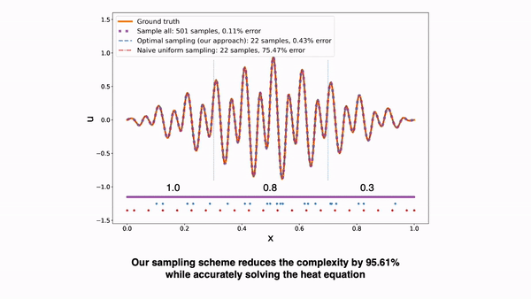
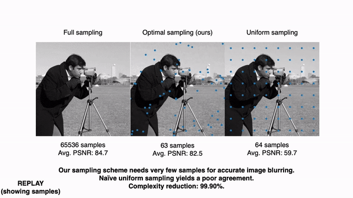
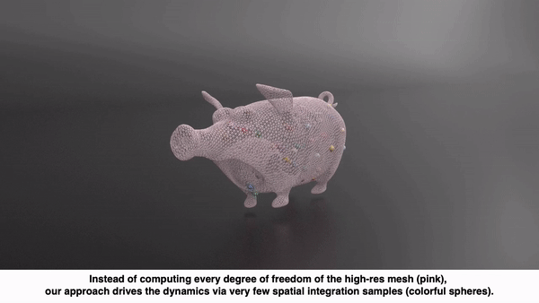
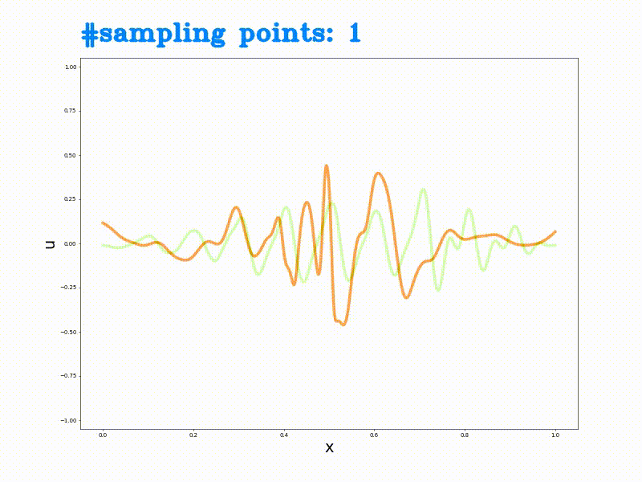

# CROM: Continuous Reduced-Order Modeling of PDEs Using Implicit Neural Representations (Part II - Latent Space Dynamics)

<p align="center">

</p>
<p align="center">

</p>
<p align="center">

</p>

This repository is part II of the official implementation of the paper:

> **[CROM: Continuous Reduced-Order Modeling of PDEs Using Implicit Neural Representations](https://arxiv.org/abs/2206.02607)**  
> [Peter Yichen Chen](https://peterchencyc.com), [Jinxu Xiang](https://www.linkedin.com/in/jinxu-xiang-0862631a2), [Dong Heon Cho](https://www.linkedin.com/in/david-cho-003285131), G A Pershing, [Henrique Teles Maia](https://henriquetmaia.github.io), [Maurizio Chiaramonte](https://www.linkedin.com/in/maurizio-chiaramonte-03779762), [Kevin Carlberg](https://kevintcarlberg.net), [Eitan Grinspun](https://www.dgp.toronto.edu/~eitan/)  
> Columbia University, Meta Reality Labs Research, University of Toronto  

Part II focuses on Section 4 of the paper, Latent Space Dynamics

We assume knowledge of Part I of the implementation, where the user already trains a low-dimensinal manifold from the training data (Section 3 of the paper, Manifold Construction). Part II solves PDEs by rapidly traversing in the latent space.

We provide three pre-trained models (built with Part I). We then conduct latent space dynamics on PDEs from theromdynamics, image processing, and elasticity / soft body.

> TODO: link to Part I

## Get Started

### Prerequisites
We assume a fresh install of Ubuntu 20.04. For example,

```
docker run --gpus all --shm-size 128G -it --rm -v $HOME:/home/ubuntu ubuntu:20.04
```

Install python and pip:
```
apt-get update
apt install python3-pip
```

### Dependencies
Install python package dependencies through pip:

```
pip install torch==1.11.0+cu113 -f https://download.pytorch.org/whl/cu113/torch_stable.html
pip install -r requirements.txt
```

In summary, our only dependecies are [PyTorch](https://pytorch.org) and [h5py](https://www.h5py.org).

## Latent Space Dynamics
With everything above installed, we are ready to run the actual code :) Below we provide three examples that solve PDEs by traversing in the latent space (Section 4 of the paper).

### Theromodynamics
```
python3 online/execute_diffusion.py -device [device]
```
### Image Smoothing
```
python3 online/execute_diffuseimage.py -device [device]
```
### Elasticity / Soft Body
```
python3 online/execute_online.py -device [device]
```

### Advection
```
python3 online/execute_advection.py -device [device]
```

### Burgers' Equation
```
python3 online/execute_burger.py -device [device]
```

[device] is either cpu or cuda. Depending on the choice of [device], our code can be executed either on cpu or gpu. For the elasticity example, executing on cuda significantly accelerates the simulation.

Computed results are stored in the output directory.

## Optimal Sampling
As discussed in Section 4.4 of the paper, our method achieves maximum speedup by using very few spatial samples (compared to the ground truth training data). One way to choose these samples is via the greedy heuristics discussed in the paper. 

<p align="center">

</p>

As shown above, as this approach gradually adds samples, the accuracy of the latent space dynamics improves.

Below we provide two examples of computing spatial samples via this greedy heuristics. 

### Theromodynamics
```
python3 optimal_sampling/execute_diffusion.py -device [device]
```
### Image Smoothing
```
python3 optimal_sampling/execute_diffuseimage.py -device [device]
```
We recommend using "CUDA" for device for better performances. Optimal sampling typically takes hours to run.

Alternatively, spatial samples can be also be chosen via the stochastic sampling approach, as it is done in the elasticity example.

## High-Level structure
The code is organized as follows:
* *common* contains utility functions
* *data* contains necessary precomputed data for latent space dynamics. They are NOT training data.
* *online* contains the real meat of the latent space dynamics that use very few spatial samples
* *optimal_sampling* contains all the code related to optimal sampling
* *weights* pre-trained model produced by Part I

## Citation
If this library helped you in a publication, please cite our paper so others can find our code and benefit as well.
```
@article{chen2022crom,
  title={{CROM}: Continuous Reduced-Order Modeling of {PDE}s Using Implicit Neural Representations},
  author={Chen, Peter Yichen and Xiang, Jinxu and Cho, Dong Heon and Pershing, GA and Maia, Henrique Teles and Chiaramonte, Maurizio and Carlberg, Kevin and Grinspun, Eitan},
  journal={arXiv preprint arXiv:2206.02607},
  year={2022}
}
```

## Contact
Feel free to reach out to us if you have any question! We would love to get in touch.