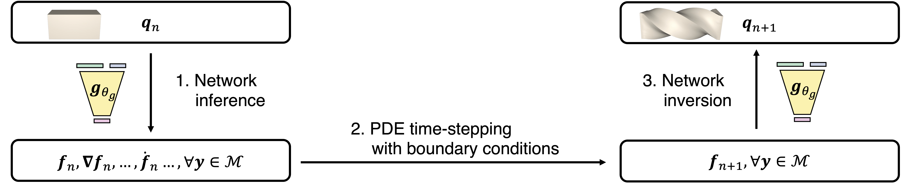

# CROM: Continuous Reduced-Order Modeling of PDEs Using Implicit Neural Representations (Part II - Latent Space Dynamics)

<p align="center">

</p>

This repository is part II of the official implementation of the paper:

> **[CROM: Continuous Reduced-Order Modeling of PDEs Using Implicit Neural Representations](https://arxiv.org/abs/2206.02607)**  
> [Peter Yichen Chen](https://peterchencyc.com), [Jinxu Xiang](https://www.linkedin.com/in/jinxu-xiang-0862631a2), [Dong Heon Cho](https://www.linkedin.com/in/david-cho-003285131), [Yue Chang](https://changy1506.github.io), [Dong Heon Cho](https://www.linkedin.com/in/david-cho-003285131), G A Pershing, [Henrique Teles Maia](https://henriquetmaia.github.io), [Maurizio M. Chiaramonte](https://www.linkedin.com/in/maurizio-chiaramonte-03779762), [Kevin Carlberg](https://kevintcarlberg.net), [Eitan Grinspun](https://www.dgp.toronto.edu/~eitan/)  
> Columbia University, Meta Reality Labs Research, MIT CSAIL, University of Toronto

See the project page for more details (including videos): https://crom-pde.github.io

Part II focuses on Section 4 of the paper, Latent Space Dynamics. We assume knowledge of [Part I](https://github.com/dc3042/CROM_offline_training) of the implementation, where the user already trains a low-dimensinal manifold from the training data (Section 3 of the paper, Manifold Construction). Part II solves PDEs by rapidly traversing in the latent space.

We provide several pre-trained models (built with [Part I](https://github.com/dc3042/CROM_offline_training)). We then conduct latent space dynamics on examples from theromdynamics, image processing, and elasticity / soft body, advection, Burger's equations, the Navier-Stokes equations (Karman vortex street).

## Get Started

### Prerequisites
We assume a fresh install of Ubuntu 20.04. For example,

```
docker run --gpus all --shm-size 128G -it --rm -v $HOME:/home/ubuntu ubuntu:20.04
```

Install python and pip:
```
apt-get update
apt install python3-pip
```

### Dependencies
Install python package dependencies through pip:

```
pip install torch==1.11.0+cu113 -f https://download.pytorch.org/whl/cu113/torch_stable.html
pip install -r requirements.txt
```

In summary, our only dependecies are [PyTorch](https://pytorch.org), [h5py](https://www.h5py.org) and some common used drawing packages.

## Latent Space Dynamics
With everything above installed, we are ready to run the actual code :) Below we provide examples that solve PDEs by traversing in the latent space (Section 4 of the paper).

### Theromodynamics
```
python3 execute/execute_diffusion.py -device [device]
```
### Image Smoothing
```
python3 execute/execute_diffuseimage.py -device [device]
```
### Elasticity / Soft Body
```
python3 execute/execute_elasticity.py -device [device]
```
### Advection
```
python3 execute/execute_advection.py -device [device]
```
### Burgers' Equation
```
python3 execute/execute_burger.py -device [device]
```
### The Navier-Stokes equations (Karman vortex street)
```
python3 execute/execute_karman.py
```

[device] is either cpu or cuda. Depending on the choice of [device], our code can be executed either on cpu or gpu. For the elasticity example, executing on cuda significantly accelerates the simulation.

Computed results are stored in the output directory.

## Robust Sampling
As discussed in Section 4.4 of the paper, our method achieves maximum speedup by using very few spatial samples (compared to the ground truth training data). One way to choose these samples is via the greedy heuristics discussed in the paper. 

<p align="center">

</p>

As shown above, as this approach gradually adds samples, the accuracy of the latent space dynamics improves.

Below we provide two examples of computing spatial samples via this greedy heuristics. 

### Theromodynamics
```
python3 execute/execute_optim_diffusion.py -device [device]
```
### Image Smoothing
```
python3 execute/execute_optim_diffuseimage.py -device [device]
```
We recommend using "CUDA" for device for better performances. Robust sampling typically takes hours to run.

Alternatively, spatial samples can be also be chosen via the stochastic sampling approach, as it is done in the elasticity example.

## High-Level structure
The code is organized as follows:
* *common* contains utility functions
* *data* contains necessary precomputed data for latent space dynamics and training data for robust sampling. 
* *online* contains the real meat of the latent space dynamics that use very few spatial samples. In addition, It also contains optimal sampling codes related to robust sampling (even though optimal sampling is technically an offline process).
* *execute* is a wrapper of everything in *online*.
* *weights* pre-trained model produced by [Part I](https://github.com/dc3042/CROM_offline_training)

## Citation
If this library helped you in a publication, please cite our paper so others can find our code and benefit as well.
```
@inproceedings{
chen2023crom,
title={{CROM}: Continuous Reduced-Order Modeling of {PDE}s Using Implicit Neural Representations},
author={Peter Yichen Chen and Jinxu Xiang and Dong Heon Cho and Yue Chang and G A Pershing and Henrique Teles Maia and Maurizio M Chiaramonte and Kevin Thomas Carlberg and Eitan Grinspun},
booktitle={The Eleventh International Conference on Learning Representations },
year={2023},
url={https://openreview.net/forum?id=FUORz1tG8Og}
}
```

## Contact
Feel free to reach out to us if you have any question! We would love to get in touch.
